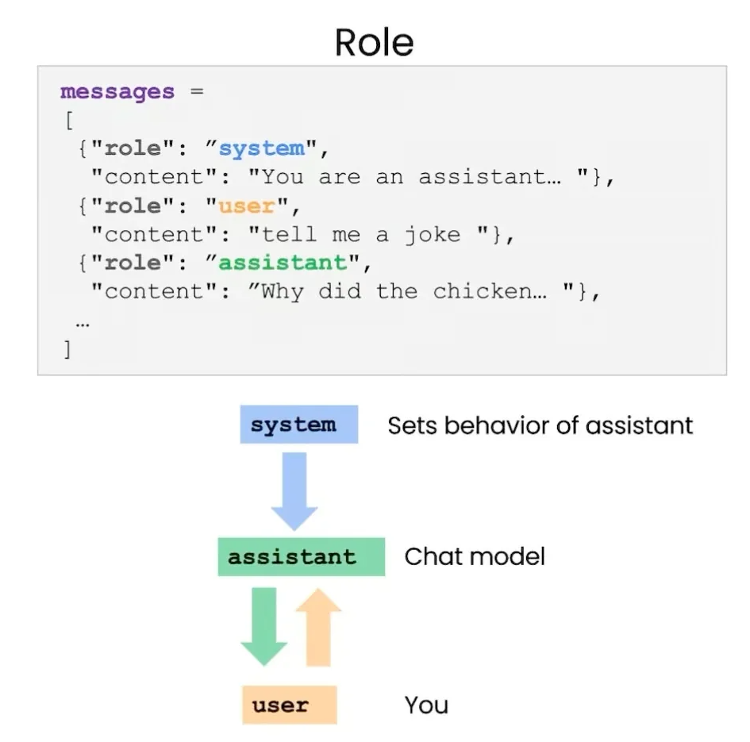
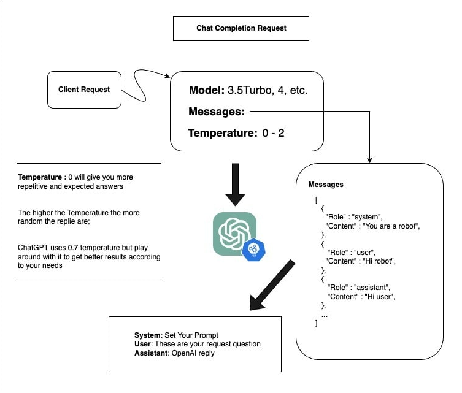

## ChatGPT and Azure OpenAI API Guide

### Introduction

In this lesson, we will explore how to create a simple chatbot using Python, OpenAI's language model, and the Azure OpenAI API. We'll learn about the roles of prompts, system messages, and how to manage conversations with a language model.

### What is Azure OpenAI?

Azure OpenAI provides access to OpenAI's advanced language models via Azure's cloud platform. This allows developers to integrate natural language understanding and generation capabilities into their applications, enabling functionalities such as chatbots, text summarization, and translation services.

### Understanding Prompts and System Messages

#### Prompts

A prompt is the input text given to the language model to generate a response. In the context of a chatbot, the user's input acts as the prompt.

#### System Messages

System messages are special prompts that set the behavior or context for the language model. These messages guide the model's responses, ensuring they adhere to specific rules or styles.

**Example of System Message Usage:**
```json
{"role": "system", "content": "You are a helpful assistant. Answer in a friendly and informative manner."}
```

### Roles in Messages

Messages are structured as a list, where each message has a role. The roles can be "system," "user," or "assistant."

- **System**: Sets the context or behavior of the assistant.
- **User**: Represents the user's input or question.
- **Assistant**: Contains the model's response.



This diagram illustrates how different roles interact to form a conversation.

### Chat Completion Request Flow

The flow of a chat completion request involves setting the model, providing messages, and adjusting the temperature.



- **Model**: Specifies which version of the language model to use.
- **Messages**: A list of messages forming the conversation, with roles defining their context.
- **Temperature**: Controls the randomness of responses, where 0 gives more predictable results and higher values increase randomness.

This diagram provides a visual representation of how these components interact.


<details><summary><h3>Example Code</h3></summary>
### Example Code

Here's a simple Python script to interact with Azure OpenAI:

```python
import os
import dotenv
from openai import AzureOpenAI

# Load environment variables
dotenv.load_dotenv()
AOAI_ENDPOINT = os.getenv("AZURE_OPENAI_ENDPOINT")
AOAI_KEY = os.getenv("AZURE_OPENAI_API_KEY")

# Set up the Azure OpenAI client
client = AzureOpenAI(api_key=AOAI_KEY, azure_endpoint=AOAI_ENDPOINT, api_version="2024-05-01-preview")

# Example with system message
response = client.chat.completions.create(
    model="gpt-35-turbo",
    messages=[
        {"role": "system", "content": "You are a helpful assistant. Answer the question in both English and French."},
        {"role": "user", "content": "What is the capital of France?"}
    ]
)
print(response.choices[0].message.content)

# Function to generate responses
def generate_response(prompt, model="gpt-35-turbo"):
    response = client.chat.completions.create(
        model=model,
        messages=[{"role": "user", "content": prompt}]
    )
    return response.choices[0].message.content

print(generate_response("Who is the quarterback for the Dallas Cowboys?"))
```

### Using the Provided Code

1. **Setup**: Ensure you have Python and necessary libraries installed.
2. **Environment Variables**: Create a `.env` file with your Azure OpenAI endpoint and API key.
3. **Run the Script**: Execute the script to interact with the model and get responses.

</details>


### Conclusion

By understanding and utilizing prompts, system messages, and the structure of message roles, you can effectively manage conversations with a language model. Experiment with different system messages and prompts to see how the model's responses change, and apply these principles to build more sophisticated applications.