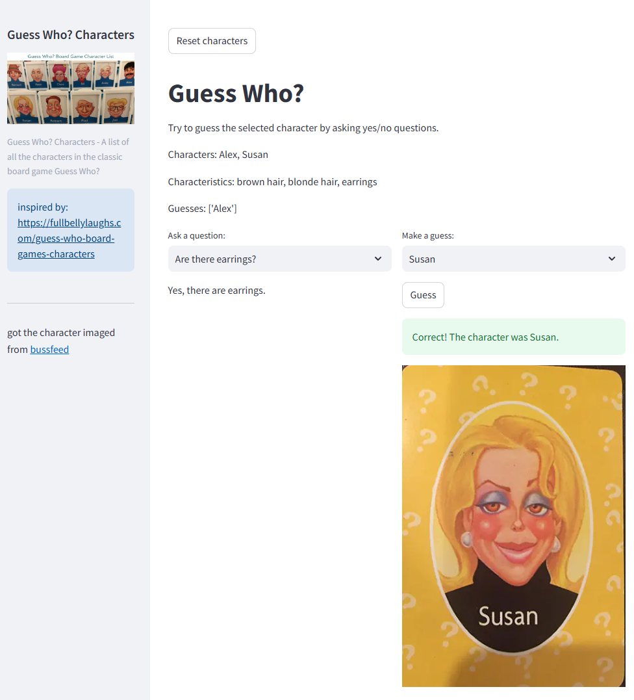

# Lesson 4: Streamlit Games and AI Integration 🎮🤖  


## Welcome Back Coders!  
   
Welcome to Lesson 4 of the BSMP24 Advanced Coding Program! Today's session is all about fun and games – quite literally! We'll be exploring several Streamlit-based games and diving into the process of cloning, setting up, and running a Streamlit game in your coding environment. Plus, we'll touch upon enhancing games with Azure OpenAI. Prepare to level up your coding skills with interactive game development!  
   
## Goals 🎯  
   
- Explore various Streamlit games and understand their mechanics.  
- Learn the process of cloning a game repository and setting it up in GitHub Codespaces.  
- Incorporate Streamlit's interactive elements and Azure OpenAI into your own game for an engaging user experience.  
   
## Lesson Overview 📖  
   
- **Streamlit Game Demos**: Play and analyze StreamlitLand Adventure RPG, Streamlit Dungeon Crawler, and Streamlit Battleships.  
- **Cloning and Running a Game**: Step-by-step guide on how to clone the Battleships game and run it.  
- **Homework - Build Your Own Streamlit Game**: Instructions and requirements for creating your own game with Streamlit and Azure OpenAI integration.  

👉 see `streamlit run guess_who_demo.py` in the `guess_who` director to see an example game in streamlit, whwer we  have the person guess  who the character is, like the old **Guess Who** board game. 



## Explore Streamlit Game Demos

Start here! Explore some of these game! 🎮🕹️

- [StreamlitLand Adventure RPG](https://github.com/TomJohnH/streamlit-game) 👉 https://adventure.streamlit.app
- [Streamlit Dungeon Crawler](https://github.com/TomJohnH/streamlit-dungeon) 👉 https://dungeon.streamlit.app
- [Streamlit Battleships](https://github.com/shakamoushie/battleships/) 👉 https://battleshipsgame.streamlit.app
- [streamlit galories](https://streamlit.io/gallery?category=favorites)

## Cloning and Running the Battleships Game 🛠️  
   
1. **Git Clone in GitHub Codespaces**: Use the terminal in your existing GitHub Codespace and enter the following command to clone the Battleships repository:  
   ```  
   git clone https://github.com/shakamoushie/Battleships.git  
   ```  
2. **Navigating to the Cloned Repository**: Once the repository is cloned, change your directory by running:  
   ```  
   cd Battleships  
   ```  
3. **Installing Dependencies**: Install the `streamlit_autorefresh` package using pip:  
   ```  
   pip install streamlit_autorefresh  
   ```  
4. **Running the Game**: Launch the game by executing:  
   ```  
   streamlit run battleships.py  
   ```  
----
# Homework: Develop Your Own Streamlit Game 🏠🎲  
   
For this homework, you're going to create a fun Streamlit game that leverages both your Python skills and the power of Streamlit's interactive widgets. Your task is to choose a game and implement it with Azure OpenAI integration for extra credit.  
   
## Your Task 🚀  
   
Choose one of the game ideas provided or come up with your own. Make sure to include the following components:  
   
1. **A Game Introduction Page**: Introduce the game and explain the rules.  
2. **A Strategy Guide Page**: Share tips or strategies to help players win.  
3. **A Game Play Page**: This is where players can engage with the game.  
   
## Requirements 📝  
   
- **Lists**: Utilize lists to manage game elements.  
- **If Statements**: Use `if` statements for game logic.  
- **For Loops** 👉 **optional**: Implement `for` loops for tasks like checking win conditions.  
- **Images**: Include images for a visually appealing game.  
- **Input Widgets**: Use Streamlit widgets like buttons and text input for gameplay.  
- **Interactive Streamlit Elements**: Get creative with Streamlit's widgets.  
- **Add AI**: Integrate Azure OpenAI into your game to create dynamic interactions.  
 
   
You'll receive your repository to work on the assignment upon acceptance.  
   
## Enhancing the "Guess Who?" Game with Azure OpenAI and GitHub Copilot  
   
In this lesson, we will also guide you through enhancing a basic "Guess Who?" game with Azure OpenAI for dynamic responses and utilizing GitHub Copilot for code improvements.  

## Azure Open AI Secrets and `.env` file
👉 dont forget to create the `.env` and add the secrets for `AZURE_OPENAI_ENDPOINT` and `AZURE_OPENAI_API_KEY` from lesson2. 
   
## Ready? Let's Code! 🏁  
   
Create your chatbot and share your progress! 🚀


### Activity Steps:  
   
1. **Review the Static Game**: Analyze the `guess_who.py` file.  
2. **Understand Azure OpenAI Integration**: Study the `streamlit_aoai_basic.py` file.  
3. **Leverage GitHub Copilot**: Use the provided prompt to enhance your "Guess Who?" game with Azure OpenAI.  
   
## Resources 🔗  
   
- [Streamlit Documentation](https://docs.streamlit.io/)  
- [Azure OpenAI Documentation](https://docs.microsoft.com/en-us/azure/cognitive-services/openai/overview)  
- [GitHub Copilot Documentation](https://copilot.github.com/)  
   
## Conclusion  
   
Have fun playing with Streamlit games and remember to be creative with your homework. We're excited to see the games you'll come up with, especially those integrating Azure OpenAI for that extra bit of flair and interactivity!  
   
Good luck, coders! Let the games begin! 🚀🎮