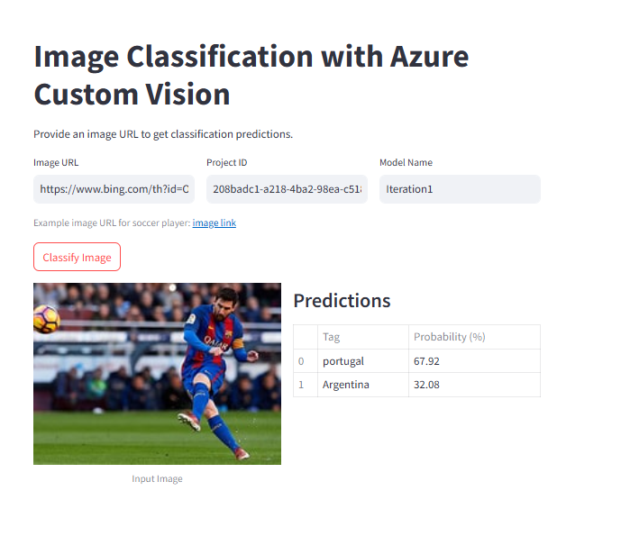

# Lesson 7: Azure AI Services Integration
Welcome back coders! In this lesson, we'll explore how to integrate Azure AI services into Python applications. We'll cover a range of topics, including:
* Using Azure Custom Vision models in Python applications
* Exploring DALL-E 3 with Azure OpenAI
* Text to Speech (TTS) Integration with Azure OpenAI and Streamlit

Let's dive in and learn how to leverage Azure AI services to build powerful applications!

## Custom Vision in Python

Welcome to our lesson on integrating Azure Custom Vision models into Python applications. Today, we'll explore how to use the models you've trained on [Custom Vision AI](https://www.customvision.ai/) within Python apps using the `azure-cognitiveservices-vision-customvision` SDK. This lesson will cover implementing these models in both Flask and Streamlit applications.

| streamlit_demo | flask_demo  |
|---|---|
|  |   |

Go to `customvisionai` folder and follow the instructions in the `README.md` to run the Streamlit and Flask apps.

## Exploring DALL-E 3 with Azure OpenAI

In this lesson, we'll dive into the fascinating world of AI-generated images using Azure OpenAI's DALL-E 3 model. DALL-E is a cutting-edge AI model capable of generating images from textual descriptions, allowing us to bring imaginative concepts to visual life. This guide will walk you through understanding how DALL-E works, utilizing the Azure OpenAI API to generate images, and integrating this functionality into a Streamlit application.

Go to `dalle` folder and follow the instructions in the `README.md` to run the Streamlit app and generate AI-generated images.

## Text to Speech (TTS) Integration with Azure OpenAI and Streamlit
In this lesson, we'll explore how to use Azure OpenAI's Text to Speech (TTS) capabilities to convert text into spoken words. We'll start by understanding the basics of TTS and then implement a simple Python script (`tts_client.py`) to generate speech. Finally, we'll integrate TTS into a Streamlit app (`streamlit_app.py`) to provide a user-friendly interface for converting text to speech and playing the audio.

Go to `tts` folder and follow the instructions in the `README.md` to run the Streamlit app and convert text to speech.

* [Azure OpenAI Text to Speech Guide](https://platform.openai.com/docs/guides/text-to-speech/overview) 
* [Azure OpenAI Quickstart](https://learn.microsoft.com/en-us/azure/ai-services/openai/text-to-speech-quickstart?tabs=command-line)