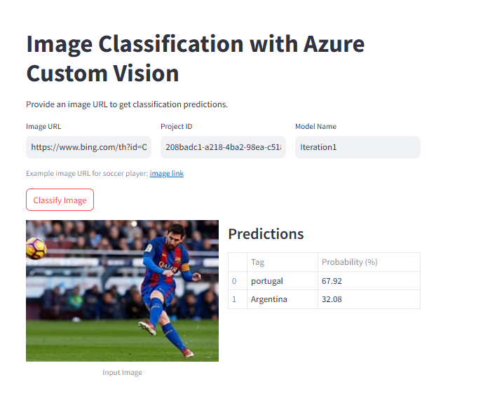
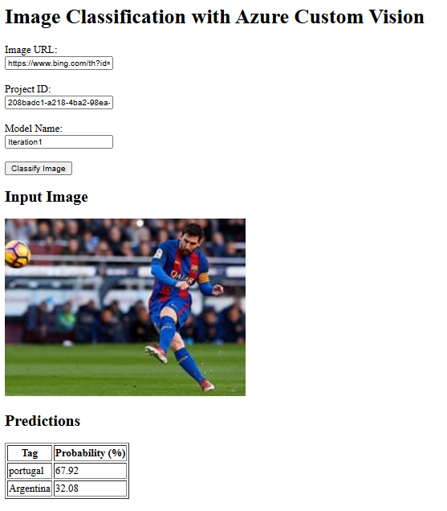
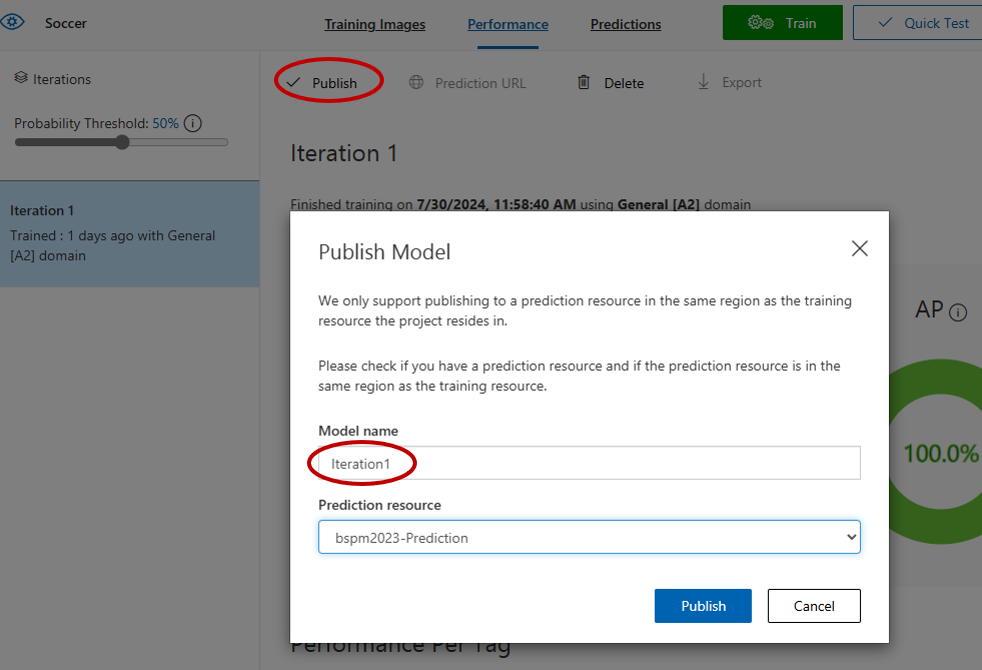
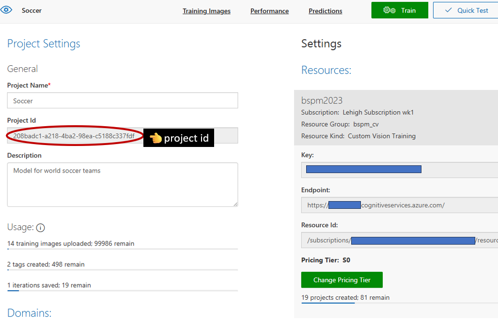
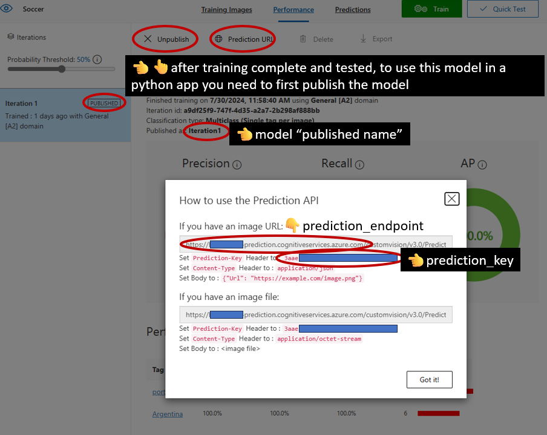

# Custom Vision in Python

## Introduction

Welcome to our lesson on integrating Azure Custom Vision models into Python applications. Today, we'll explore how to use the models you've trained on [Custom Vision AI](https://www.customvision.ai/) within Python apps using the `azure-cognitiveservices-vision-customvision` SDK. This lesson will cover implementing these models in both Flask and Streamlit applications.

| streamlit_demo | flask_demo  |
|---|---|
|  |   |


<!--
<div>
  
  
</div>
-->

## Prerequisites

Before we begin, ensure you have:

1. **A Custom Vision Project**: Make sure you've created a project, uploaded and labeled images, trained your model, and tested it.
2. **Published Your Model**: Your best iteration should be published to make it available for predictions.
3. **GitHub Codespaces Environment**: We're working in GitHub Codespaces with all necessary Python packages pre-installed. 
   1. If you're not using GitHub Codespaces, ensure you have the required packages installed in your local environment. `pip install -r requirements.txt`

## Lesson Outline

### Step 1: Publish Your Model

- **Objective**: Make your trained model available for prediction.
- **How To**:
  - Navigate to your project on Custom Vision AI.
  - Go to the `Performance` tab, select your best model iteration, and click the `Publish` button.
  - Take note of the `Published Name` of your model, as you will need this information for predictions.



### Step 2: Gather Required Information

For both python code and python apps like Flask and Streamlit applications, you need:

- **Project ID**: Found under `Project Settings`.
    
- **Prediction Key**: Located in the `Settings` section under `Resources`.
- **Prediction Endpoint**: Also found in the `Settings` section.
- **Published Model Name**: The name assigned when publishing the model.



### Step 3: Implementing the Model

#### Python Script

For a more direct interaction with the Custom Vision model using a Python script:

#### Python Script Setup

1. **Gather Variables**: From steps 1 and 2, ensure you have your `ENDPOINT`, `PRED_ENDPOINT`, `prediction_key`, `projectid`, and `model_name` ready.
2. **Update the `.env` file**: Ensure that your `.env` file includes the `CUSTOMVISIONAI_PREDICTION_KEY`.

#### Using the Model in Python

1. **Script Overview**: The `predict_image.py` script uses the `azure-cognitiveservices-vision-customvision` SDK to classify images. Update the script with your specific values for the endpoint, project ID, and model name.

#### Running the Script

1. **Save the Script**: Save the updated script as `predict_image.py`.
2. **Run the Script**: In GitHub Codespaces or your local environment, execute the script with:
   ```sh
   python predict_image.py
   ```
3. **View Results**: The console will display the classification predictions for the test image.

#### Flask App

- **Objective**: Create a web application using Flask that can classify images based on a given URL.
- **Setup**:
  - The Flask app will allow users to input an image URL, choose the project ID and model name, and see the classification results.
  - To run the Flask app: Save the provided `flask_app.py` file, install Flask if not already installed, and run `python flask_app.py`.

#### Streamlit App

- **Objective**: Build a Streamlit app for a more interactive and visually appealing interface.
- **Setup**:
  - Streamlit provides an easy way to create web apps for machine learning and data science.
  - The app will have fields for image URL, project ID, and model name, and display the image and predictions side-by-side.
  - To run the Streamlit app: Save the provided `streamlit_app.py` file and run `streamlit run streamlit_app.py`.

## Running the Apps

### Flask Application

1. **Navigate to the directory** containing `flask_app.py`.
2. **Run the Flask server**: `python flask_app.py`.
3. **Visit the local server**: Typically at `http://127.0.0.1:5000/`.
4. **Input an image URL** and other necessary details to see the predictions.


### Streamlit Application

1. **Navigate to the directory** containing `streamlit_app.py`.
2. **Run the Streamlit server**: `streamlit run streamlit_app.py`.
3. **Access the app in your browser**, where you can interactively enter data and view predictions.


## Conclusion

This lesson provides practical insights into deploying machine learning models using Python, Flask, and Streamlit. It's an excellent way to see how your models perform in real-world scenarios and offers a foundation for building more complex AI applications.

## Resources

- [Azure Custom Vision Documentation](https://learn.microsoft.com/en-us/azure/ai-services/custom-vision-service/quickstarts/image-classification?tabs=linux%2Cvisual-studio&pivots=programming-language-python)
- [Flask Documentation](https://flask.palletsprojects.com/)
- [Streamlit Documentation](https://docs.streamlit.io/)

Happy coding! Feel free to ask questions or seek help as needed.